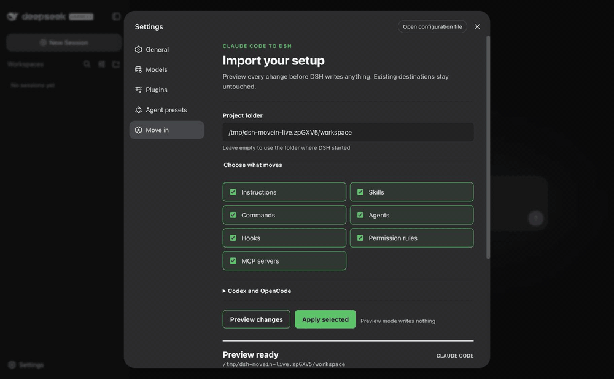

# Claude Code 配置搬到 DSH：先预演，保留已有文件

[English README](../README.md) · [中文 README](./README.zh.md) · [给 coding agent 的指令](./agent-setup.md#中文)

想试 DSH，但不想重新整理 Claude Code 的技能和配置？先看搬家清单，再决定应用哪些变化。dsh-movein 的默认操作是预演，不会因为扫描到了文件就直接写入。

我维护 dsh-movein 和 dsh-win32。本文只展示可复现的文件迁移，不承诺所有 hooks、权限规则或完整 DSH 会话等价。

## 先看一个不会接触你配置的例子

仓库提供[可执行的合成数据示例](../demo/verify-first-migration.mjs)。它调用与产品相同的扫描、规划和应用引擎，在临时目录中真正复制文件并检查结果，不是手写“成功”输出。

它特意放入两类已有目标：一份全局 instruction 和一个同名 skill。预期是保留它们，只搬入另外两个技能。项目里的 `CLAUDE.md` 保留在原地，因为 DSH 原生读取它。

在没有同名目录的位置克隆仓库，再运行：

```sh
git clone https://github.com/sjh9714/dsh-movein.git
cd dsh-movein
npm ci
node demo/verify-first-migration.mjs
```

`npm ci` 会安装仓库开发依赖；演示脚本本身不下载 DSH、不访问模型、不安装插件、不执行 hook、不操作 GitHub。它显式指定合成来源与目标，不使用你的 Claude 或 DSH profile。

成功运行会得到下面的检查结果；任何断言失败都会以非零退出码结束：

```text
1. 预演：2 个待搬技能，2 个已有目标保留；没有写入。
2. 应用：2 个技能内容逐字节一致；已有目标和来源文件未改动。
3. 再预演：0 个待搬项目；没有重复写入。
清理：仅删除本次创建的临时目录。
```

这是迁移引擎的合成数据实跑，不是 Windows 录屏，也不是 DSH Settings、插件安装或完整模型会话验收。CI 会在 Linux、Windows 和 macOS 重跑这个例子；具体结果以该提交的 [Actions](https://github.com/sjh9714/dsh-movein/actions) 为准。

## 再试自己的项目：预演与应用分开

在要搬入的项目目录中运行：

```sh
npx dsh-movein
```

检查来源、目标、冲突和不支持项。不要公开完整预演输出，它可能包含私人路径或配置。只有确认这些变化后，才运行：

```sh
npx dsh-movein --apply
npx dsh-movein doctor
```

已有目标会跳过，而不是覆盖。需要复制 skills 而不是创建符号链接时，在预演和应用两次命令中都加 `--copy`。这不代表所有资产都会改用复制，也不代表全部配置可无损迁移。

Codex 使用 `--from codex`，OpenCode 使用 `--from opencode`。具体哪些内容能搬、哪些仅提示而不转换，见[兼容性表](./compat.md)。

## 更喜欢设置页？

使用你已安装的官方 DSH CLI：

```sh
dsh plugin --profile web add dsh-movein
```

确认 profile 中实际安装的版本，再重启对应 `dsh web`，打开 **Settings → Move in**。选择类别、预演、查看冲突，再应用。PATH 中没有 `dsh` 时，先按 [DSH 官方说明](https://github.com/deepseek-ai/deepseek-harness#run) 确认 launcher；不要在不知情时切换到另一套 DSH。



上图是已有的 DSH `0.1.1-rc.2` 两张真实截图组成的 GIF，不是本次新录制的视频。`doctor --live` 检查配置组合及安全的官方基线，不启动迁移后的 hooks，也不证明它们能阻止危险操作。

如果 pnpm 的发布等待期导致安装到较早版本，保留政策并稍后重试；不要降低 `minimumReleaseAge`。native-loader 故障与版本选择是不同问题，参见 [README 中的已知边界](../README.md#after-moving)。

## Windows 与会话历史：分开选择

- Windows 上 PowerShell 不能启动时，先看 [dsh-win32 排错指南](https://github.com/sjh9714/dsh-win32/blob/master/docs/windows-first-run.zh.md)，解决 host 问题后再搬配置。
- 想继续以前的对话时，[dsh-chat-import](https://github.com/Nwflower/dsh-chat-import) 负责会话历史；Movein 负责配置。只需要设置或只需要历史的用户不必安装两个工具。

两个项目的组合流程尚未联合验证，也未获得对方背书。先分别检查来源、目标、重复导入与回滚边界，不启用未验证的自动同步。这份文档不是联合安装脚本。

## 试完后，什么反馈最有用？

告诉我们来源工具、版本、预演中缺了哪类资产，或哪个冲突仍需手工处理即可。请用合成文件提交[最小复现](https://github.com/sjh9714/dsh-movein/issues)，不要上传真实会话、密钥或完整配置。

如果实际节省了配置时间，欢迎自愿 [Star dsh-movein](https://github.com/sjh9714/dsh-movein)。不 Star 也能使用全部功能并获得同样的帮助。
